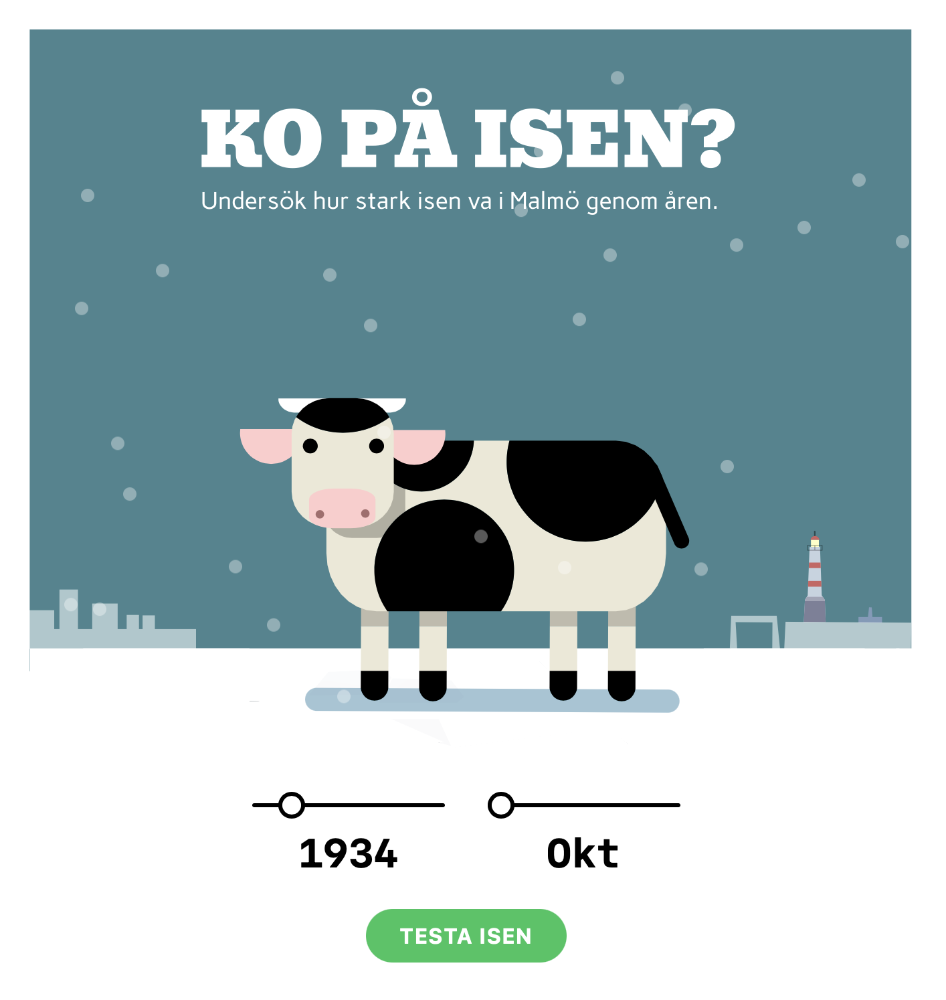

# 

## Ko på isen

**En fullstack-applikation som kombinerar 100 års väderdata, vetenskaplig fysik och interaktiv animering för att svara på en rolig (men vetenskapligt komplex) fråga: Kunde en ko stå på isen i någon av Malmös historiska vintrar?**

[🚀 Live Demo](https://ko-paa-isen.vercel.app)

_Jag vill med detta projekt visa fram hur jag tänker, designar, implementerar och förklarar ett komplett datadrivet system från rådata av en databas till en levande interaktiv infografik._

---

## Idé & Syfte

Användaren väljer år och månad (vinterhalvåret), trycker på "Testa isen" och får omedelbar visuell feedback:

- **Om isen är tillräckligt tjock:** Kon står stabilt på isen (och den animerade kossan är nöjd)
- **Om isen är för tunn:** Kon åker genom isen (med överraskad min och fladdrande öron)

Allt bygger på:

1. **Historiska data** CSV filer från SMHI (39 381 dagsobservationer, tre väderstationer, fr. 1917–2026)
2. **Vetenskaplig modellering** (Stefan-formeln för istjocklek, Golds regel för bärighet)
3. **Backend-kalkyl** (FDD-ackumulering, validering)
4. **Frontend-visualisering** (React, interaktiva Rive-animationer, responsiv design)

---

## Datakälla

- SMHI:s historiska temperaturdata för Malmö hamn, 1917–2026
- Tre väderstationer, sammanslagna och deduplicerade
- Data lagras i SQLite för snabb hämtning

---

## Hur det fungerar

**Stack:** React + TypeScript + Tailwind + Rive | Express + TypeScript + Winston + Zod | Turso (SQLite cloud)

**Pipeline:** SMHI-data → Turso → Backend API (`GET /api/ice?year=:year&month=:month`) → React + Rive animation

**Logik:**

- FDD-ackumulering (Freezing Degree Days) från oktober
- Stefan-formeln för istjocklek
- Gold's regel för bärighet (11 cm minimum för 400 kg ko)

Se [Detaljerad implementering](./docs/implementation.md) för full arkitektur.

---

## Fysiken kort förklarat

Istjocklek beror på **kumulativ kyla** (FDD) Altså en längre fysperiod, inte enstaka kallnätter. Stefan-formeln från 1800-talet beskriver tillväxten matematiskt. Gold's regel säger att 11 cm tjock is räcker för en 400 kg ko på Malmös saltvatten (A = 3.5 kg/cm²).

Se [Detaljerad fysik-förklaring](./docs/physics.md) för formler och konklusioner.

---

## Min tankegång kring arkitekturen

### 1. **Datadrivet designtänkande**

Jag började med **frågan**: "Vad behövs för att svara på om isen håller för en ko ?" och "Hur tjock va isen i Malmö när jag va liten" och sen arbetade bakåt:

- 100 års väderdata? ✓ Finns hos SMHI (1917–2026)
- Vetenskaplig modell för istjocklek? ✓ Stefan-formeln är väletablerad
- Vetenskaplig modell för bärighet? ✓ Golds regel är dokumenterad

Allt är baserat på **verifierbara fakta**, inte "hittepå."

### 2. **Separation front/backend**

Backend och frontend är helt åtskilda:

- **Backend** vet bara om matematik och databas—ingen UI-logik
- **Frontend** vet bara om rendering—ingen fysik-logik
- De pratar via ett enkelt JSON API

Denna separation gör koden testbar, skalbar och lätt att förstå. Desutom känndes FDD beräakningen mer "backend-logik" än frontend, så det kändes naturligt att lägga den där.

### 3. **Transparens i komplexitet**

En användare kan tro att beräkningen är gömd i en svart låda. Därför valde jag att visa det genom:

- **CalculationModal**: En popup som visar exakt hur beräkningen gick till
- **Kod i repot**: Varje konstant är motiverad (tex STEFAN_CONSTANT = 2.5, COW_THRESHOLD_CM = 11)

### 4. **Performance-tänk**

Jag jobbar vanligtvis i MongoDB och SQL. 39 000+ databasrader skulle kunna bli påtagligt långsamt. Lösningen:

- SQLite-indexering på `date` (supersnabb lookup på FDD perioden)
- Backend cachar inte (varje API-call är oberoende)
- Frontend cachar det senaste resultatet tills användaren ändrar år/månad

### 5. **UX via animation**

Jag gjorde Rive-animationen humoristisk, med en välkänd motion graphics-stil vilket gör den väldigt lätt att avläsa och **kommunicerar effektivt** komplex information:

- Kon står = "isen höll" (positivt, visuellt)
- Kon sjunker = "isen bröt" (negativt, omedelbar förståelse)

En siffra "13.8 cm" säger mindre än att _se_ en glad ko på stabil is.

---

## Komponenter & Arkitektur

- **Frontend:** React + Vite + TypeScript + Tailwind + Zod (runtime-validering)
- **Animation:** Rive (statemachine: stående, plums, idle animationer)
- **Backend:** Node.js + Express + TypeScript + Zod (runtime-validering) + Jest (enhetstester)
- **Databas:** Turso (SQLite cloud, 39 000+ dagar, 1917–2026)

### API

- `GET /api/ice?year=:year&month=:month` — returnerar tjockaste isen för vald månad, samt om kon klarar sig

---

## Vad jag lärde mig och vad som var tufft

**Rive State Machine & Data Binding**
Integreringen av Rive var initialt logisk, men de nya updaterade detaljerna med data binding var knepiga men lärde mer om hur det fungerar. Jag insåg att jag hade för många states och behövde förenkla till ett start (idle state) och sen en enda boolean.
Rive känns väldigt bekant, som det gamla Flash. Det var kul att lära sig, och speciellt state machines som gör det enkelt att koppla data till olika animationer.

**FDD-logik & Backend-design**
Jag ville först beräkna FDD i frontend (hur många frysdagar), men när jag tänkte på hur väder inte bara fryser men också töar på vintern läste jag på mer om Stefan-formeln insåg jag att det hörde hemma i backend — där jag redan hade all historisk data. Det blev både renare och mer korrekt. **Lärdom:** Förstå vad som fungerar på riktigt och inte bara som modell i ett labb.

**Datahantering — SQLite över Excel**
När jag försökte lägga ihop 39 000+ temperaturrader från tre olika SMHI-stationer krashade Excel. SQLite blev räddningen — och en bra påminnelse om att välja verktyg efter problem, inte vana. Som MERN-utvecklare var det också värdefullt att träna mer på SQL igen.

---

## InfoModal (för användaren)

Kort, logisk förklaring:

> För att isen ska bära en vuxen ko på 400 kg krävs minst 11 cm tjock is (Golds bärformel).
>
> Från oktober 1941 till februari 1942 var det 64 frysdagar (totalt -327 grader). 3 dagar var det över 0°C, så isen smälte tillbaka lite.
>
> Enligt Stefans istillväxtformel var tjockaste isen i februari: 48.2 cm.
>
> Golds: 400 kg / 3.5 kg/cm² = 114.3 cm² → 11 cm min
> Stefan: 2.5 × √322 = 48.2 cm
>
> // Gold's rule: 11 cm is safe
> result = iceThickness >= 11 ? "Safe for cow" : "Ice breaks";

---

## Hur jag tänkte som utvecklare

- **Datadrivet:** Allt bygger på verkliga SMHI-data, ingen "hittepå".
- **Fysikaliskt korrekt:** FDD och istillväxt enligt vetenskapliga modeller.
- **Logiskt:** Tydlig separation av konstanter och variabler, kod och matematik.
- **Pedagogiskt:** Förklarar både för användare och utvecklare hur allt hänger ihop.
- **Fullstack:** Från databas till animation.
- **Claude:** Med agentisk co-coding kunde jag tänka större, gå djupare i min vision.

---

## 📚 Läs mer

- **[Detaljerad fysik-förklaring](./docs/physics.md)** — Stefan-formeln, FDD, Gold's regel
- **[Implementering i detalj](./docs/implementation.md)** — Backend API, React hooks, data pipeline
- **[Historiskt exempel: Februari 1942](./docs/example-1942.md)** — En av Sveriges kallaste vintrar på 500 år, och hur det påverkade isen i Malmö.

---

## Roadmap

1. Datamerge & import av CSV filer (klart)
2. Backend-API med FDD-logik (klart)
3. Frontend med React + Rive (klart)
4. InfoModal-komponent (klart)
5. Finputsning, README.md & deploy (klart)
6. Zod runtime-validering — API-svar och databasrader valideras vid körtid (klart)
7. Pure functions & enhetstester — fysiklogiken isolerad och testad med Jest (klart)
8. Kodkvalitet — centraliserade konstanter, extraherad canvas-logik, ingen duplicering (klart)
9. Säkerhetshärdning — CORS origin-whitelist, rate limiting, strukturerad Winston-loggning (klart)

---

## Varför gjorde jag detta projekt?

Jag ville visa att jag kan:

✓ **Förstå domän-specifik kunskap** — Kan plugga in fysik i kod utan att det blir "hittepå"  
✓ **Designa logiskt** — Från data till användarupplevelse, varje steg känns motiverat  
✓ **Implementera fullstack** — SQLite → Backend API → Frontend UI → Animation, end-to-end  
✓ **Kommunicera komplexitet** — Visa både "vad" och "varför" för både folk som gillar att se komplex data bli visualiserad med hög nivå av visuell kommunikation & designkvalitet.  
✓ **Tänka i system** — Inte bara prata om systemer utan göra det förståeligt och underhållbart.
✓ **Matcha mot verklighet** — Resultaten matchar historiska väderdata och fysikaliska gränser

Det här är mitt sätt att säga: **Jag verkligen uppskattar när kod, design och kontext går hand i hand.**

---

**Lars Munck, 2026**
