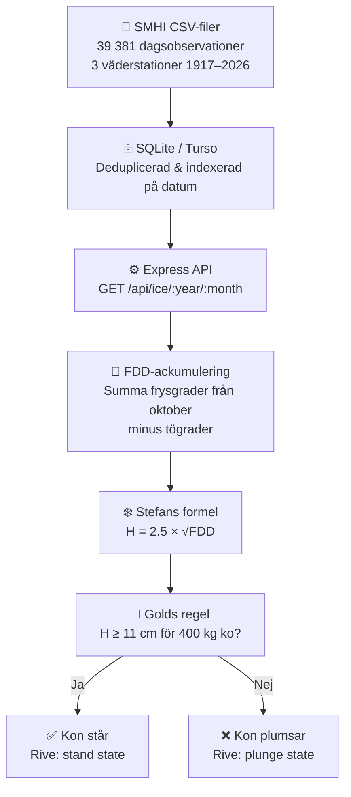

# 

## Ko på isen

Ko på Isen är en webbapp som låter dig testa huruvida **en ko hade kunnat stå på isen under de senaste 100 årens vintrar i Malmö**

[🚀 Live Demo](https://ko-paa-isen.vercel.app)

---

## Idé & Syfte

**Jag ville skapa en fullstack-applikation som kombinerar 100 års väderdata, vetenskaplig fysik och interaktiv animering för att svara på en rolig (men vetenskapligt komplex) fråga: Kunde en ko stå på isen i någon utav Malmös historiska vintrar?**

Användaren väljer år och månad (vinterhalvåret), trycker på "Testa isen" och får omedelbar visuell feedback:

- **Om isen är tillräckligt tjock:** Kon står stabilt på isen (och den animerade kossan är nöjd)
- **Om isen är för tunn:** Kon åker genom isen (med överraskad min och fladdrande öron)

Teknisk pipeline:

**Logik bakom:** FDD-ackumulering från oktober, Stefan-formeln för istjocklek, Gold's regel för bärighet (11 cm minimum för 400 kg ko).

Se [Detaljerad implementering](./docs/implementation.md) för full arkitektur och kod.

---

## Fysiken kort förklarat

Istjocklek beror på **kumulativ kyla** (FDD), så alltså isbildning under en längre frysperiod och inte enstaka kallnätter. Stefan-formeln från 1800-talet beskriver tillväxten matematiskt. Gold's regel säger sedan att 11 cm tjock is räcker för en 400 kg ko på Malmös saltvatten (A = 3.5 kg/cm²).

Se [Detaljerad fysik-förklaring](./docs/physics.md) för formler och härledning.

---

## Min tankegång kring arkitekturen

_Jag ville med detta projekt visa fram hur jag tänker, designar, implementerar och förklarar ett komplett datadrivet system från rådata av en databas till en levande interaktiv infografik._

_(I en verklig produktion så hade datan förberäknats och cachats, men jag valde medvetet bygga den på detta sättet för att hålla hela stacken synlig och demonstrerbar.)_

### 1. **Datadrivet designtänkande**

Jag började med **frågan**: "Vad behövs för att svara på om isen håller för en ko ?" och "Hur tjock va isen i Malmö när jag va liten" och sen arbetade bakåt:

- 100 års väderdata? ✓ Finns hos SMHI (1917–2026)
- Vetenskaplig modell för istjocklek? ✓ Stefan-formeln är väletablerad
- Vetenskaplig modell för bärighet? ✓ Golds regel är dokumenterad

Allt är baserat på **verifierbara fakta**, inte "hittepå."

### 2. **Separation front/backend**

Backend och frontend är helt åtskilda:

- **Backend** vet bara om matematik och databas—ingen UI-logik
- **Frontend** vet bara om rendering—ingen fysik-logik
- De pratar via ett enkelt JSON API

Denna separation gör koden testbar, skalbar och lätt att förstå. Dessutom kändes FDD-beräkningen mer "backend-logik" än frontend, så det kändes naturligt att lägga den där.

### 3. **Transparens i komplexitet**

En användare kan tro att beräkningen är gömd i en svart låda. Därför valde jag att visa det genom:

- **CalculationModal**: En popup som visar exakt hur beräkningen gick till
- **Kod i repot**: Varje konstant är motiverad (tex STEFAN_CONSTANT = 2.5, COW_THRESHOLD_CM = 11)

### 4. **Performance-tänk**

Jag jobbar vanligtvis i MongoDB och SQL. 39 000+ databasrader skulle kunna bli påtagligt långsamt. Lösningen:

- SQLite-indexering på `date` (supersnabb lookup på FDD perioden)
- Backend cachar inte (varje API-call är oberoende)
- Frontend cachar det senaste resultatet tills användaren ändrar år/månad
- Beräkningarna körs on-demand — Detta dynamiska alternativet valdes för att hålla hela pipeline:n synlig och bevisbar

### 5. **UX via animation**

Jag gjorde Rive-animationen humoristisk, med en välkänd motion graphics stil vilket gör den lätt att avläsa och **kommunicerar effektivt** komplex information via empati:

- Kon står = "isen höll" (positivt, va bra att kossan klarade sig!)
- Kon sjunker = "isen bröt" (negativt, åh nej den gick genom!)

En siffra "13.8 cm" säger mindre än att _se_ en glad ko med viftande öron på stabil is.

### 6. **Tillgänglighetsdesign (a11y)**

En Rive-animation är underhållande för andvändare med syn men säger ingenting för en användare med skärmläsare. Jag ville att upplevelsen ska fungera för alla, inte bara de med syn.

Appen är WCAG 2.2 AA-kompatibel med fokus på fem lager:

- **Semantik:** `lang="sv"`, `<main>`-landmark, korrekt `role="dialog"` på modalen
- **Etiketter:** `aria-label` och `aria-valuetext` på alla interaktiva element (sliders, knappar)
- **Skärmläsare:** `aria-live`-region som läser upp resultatet 2 sekunder in — när animationen är klar — inklusive en beskrivning av vad som händer med kon. Felmeddelanden avbryter omedelbart via `role="alert"`.
- **Tangentbord:** Fokushantering i dialogen (trap + återgång till utlösande knapp), `aria-disabled` istället för `disabled` så att fokus aldrig försvinner under laddning, `:focus-visible`-stilar på sliders.
- **Rörelse:** Animationerna är subtila och inte överväldigande, men vissa animationer deaktiveras för användare som har 'reduced-motion' aktiverat.

---

## Komponenter & Arkitektur

**Tech Stack:**

- **Frontend:** React + TypeScript + Tailwind + Rive (animation) + Zod (runtime-validering)
- **Backend:** Express + TypeScript + Winston (loggning) + Zod (runtime-validering) + Jest (tester)
- **Databas:** Turso (LibSQL cloud)
- **Tester:** 34 enhetstester (service-layer, API-routes, physics-formulas)
- **CI/CD:** GitHub Actions (test + deployment health check)

Frontend och backend kommunicerar via ett enkelt JSON API. Se [Detaljerad implementering](./docs/implementation.md) för hur varje lager fungerar.

### API

- `GET /api/ice?year=:year&month=:month` — returnerar tjockaste isen för vald månad och om kon klarar sig
- Visar även FDD-ackumulering, frys/töadagar för att användaren kan förstå beräkningen
- **CalculationModal** förklarar exakt varför resultatet blev så

---

## Vad jag lärde mig och vad som var tufft

**Rive State Machine & Data Binding**
Jag hade planerat material till 6 states men Rive-integreringen var knepig att få att fungera med dom nya data-binding uppdateringarna. Jag insåg att färre animerade states i state machine gör det lättare att lära sig. Istället för att försöka modellera flera states fick jag göra mig av med komplexiteten och använda en enda boolean. Det blev både enklare och va det enda som behövdes för appen skulle uppfylla sitt syfte.

**FDD-logik & Backend-design**
Jag ville ursprungligen nöja mig med att beräkna FDD i frontend (hur många frysdagar upp till vald månad), men när jag tänkte på hur väder inte bara fryser men också töar på vintern valde jag att göra beräkningarna utifrån "Stefan-formeln" och insåg att det hörde hemma i backend där jag redan hade all historisk data. Det blev både renare och mer korrekt.

**Datahantering — SQLite över Excel**
När jag försökte lägga ihop 39 000+ temperaturrader från tre olika SMHI-stationer krashade Excel. SQLite blev räddningen och en bra påminnelse om att välja verktyg efter problem, inte vana. Som MERN-utvecklare var det också värdefullt att träna mer på SQL igen.

---

## Hur jag tänkte som utvecklare

- **Datadrivet:** Allt bygger på 100 års verifierade väderdata från SMHI.
- **Fysikaliskt korrekt:** FDD och istillväxt enligt vetenskapliga modeller.
- **Logiskt:** Tydlig separation av konstanter och variabler, kod och matematik.
- **Pedagogiskt:** Förklarar både för användare och utvecklare hur allt hänger ihop.
- **Tillgänglighet:** Jag har strävat efter att uppnå WCAG 2.2 AA standard. Bra kontrast, tangentbordsnavigering med fullständig fokushantering, skärmläsarstöd med aria-labels och aria-valuetext på alla kontroller. Animationerna syntolkas med aria-live="polite"-meddelanden (tajmade efter animationernas längd), prefers-reduced-motion. Skärmläsare och tangentbord har testats manuellt och testats felfritt via Lighthouse & Axe Core.

---

## 📚 Läs mer

- **[Detaljerad fysik-förklaring](./docs/physics.md)** — Stefan-formeln, FDD, Gold's regel
- **[Implementering i detalj](./docs/implementation.md)** — Backend API, React hooks, data pipeline
- **[Historiskt exempel: Februari 1942](./docs/example-1942.md)** — En av Sveriges kallaste vintrar på 500 år, och hur det påverkade isen i Malmö.

---

## Roadmap

1. Data pipeline — 100 år SMHI-data → SQLite (klart)
2. Backend API med FDD & Stefan-formeln (klart)
3. Frontend + Rive animation + Accessibility (WCAG 2.2 AA) (klart)
4. Deploy & dokumentering (klart)

---

## Varför skapade jag detta projekt?

Jag var nyfiken på fysiken bakom is och ville se om jag kunde bygga något som gjorde vetenskapen synlig, inte bara som formler, utan något du kan interagera med. Det här projektet är mitt försök på att visa vad jag tycker är intressant med att skapa en fullstack applikation från data till användarupplevelse.

---

_Byggd av Lars Munck · Malmö, 2026 · Verktyg: VS Code, Claude Code, Rive_
