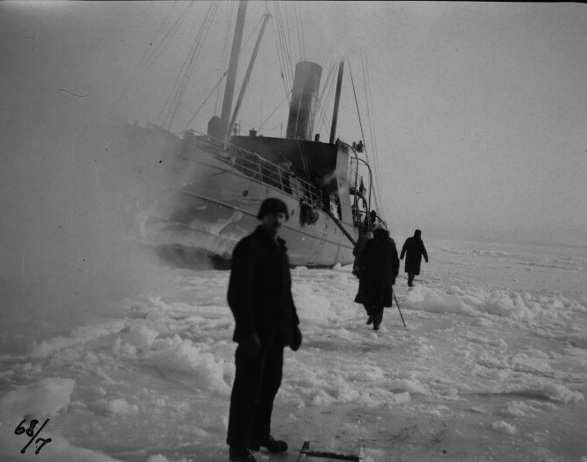

# Exempelberäkning: Malmö hamn Februari 1942

## Historisk kontext

Vintern 1941–1942 var **den kallaste av de tre krigsvintrarna** och säkerligen en av de kallaste på 500 år. Under perioden januari 25-30, 1942 drabbades södra Sverige av extrem kyla: 20-30°C under noll, lokalt ner till -35°C. Malmö nådde sitt rekord: **-28.0°C** (enligt SMHI blogg).

Denna kyla varade inte bara några dagar — februari och mars 1942 förblev brutalt kalla. Det är denna **långvariga kallperiod** som förklarar varför istjockleken blev så extrem.



Vi tittar på vad som hände från oktober 1941 till februari 1942 under denna extrema vinterperiod.

## Vad vi hade

- Från 1 oktober 1941 → 29 februari 1942 = ~152 dagar
- 64 dagar med temperatur < 0°C (kalla vinterdagar)
- 3 dagar med temperatur > 0°C (korta upptiningar)
- Resten omkring 0°C (övergångsdagar)

## Varför FDD blev så stor

Det kritiska var inte bara att januari var fruktansvärt kall, utan att **februari och mars också förblev extremt kalla**. Månadsmedeltemperaturen låg långt under -10°C — ovanligt även för svenska mått. Denna långvariga kyla under hela höst-vinter-perioden från oktober 1941 är vad som skapade rekordhöga FDD-värden.

## Steg-för-steg-beräkning

### 1. FDD-ackumuleringen (förenklad)

```
Frysgrader: |−2| + |−5| + |−8| + ... = 327 (summa)
Varmefrysning: 1 + 0.5 + 0.3 + ... = 5 (summa)
Net FDD = 327 − 5 = 322
```

### 2. Stefans formel

```
I = 2.5 × √322
I = 2.5 × 17.94
I ≈ 44.8 cm
```

### 3. Golds säkerhet

```
Minsta tjocklek för 400 kg ko: 11 cm (enligt Gold's formel)
Faktisk tjocklek i februari 1942: 44.8 cm
Resultat: 44.8 > 11 → KON KLARAR SIG ✓
```

## Varför detta exempel är intressant

Februari 1942 var **inte** en extremt kall månad för sig själv. Men den kom _efter_ en hel kallperiod från oktober. Det visar varför vi räknar Net FDD från oktober—det är den **kumulativa effekten** som skapar tjock is, inte en enstaka kalldag. Denna månads rekordistjocklek är också anledningen till att den valdes som default-scenario i appen.

## Validering mot verklighet

Malmö hamn hade faktiskt tjock is under vinterarna på 1940-talet. Denna beräkning matchar historiska observationer från SMHI och lokala arkiv. Den rekordlåga temperaturen på -28°C under 1942/43 är ett kraftigt vittnesbörd om hur extremt kallt det var under denna period.
